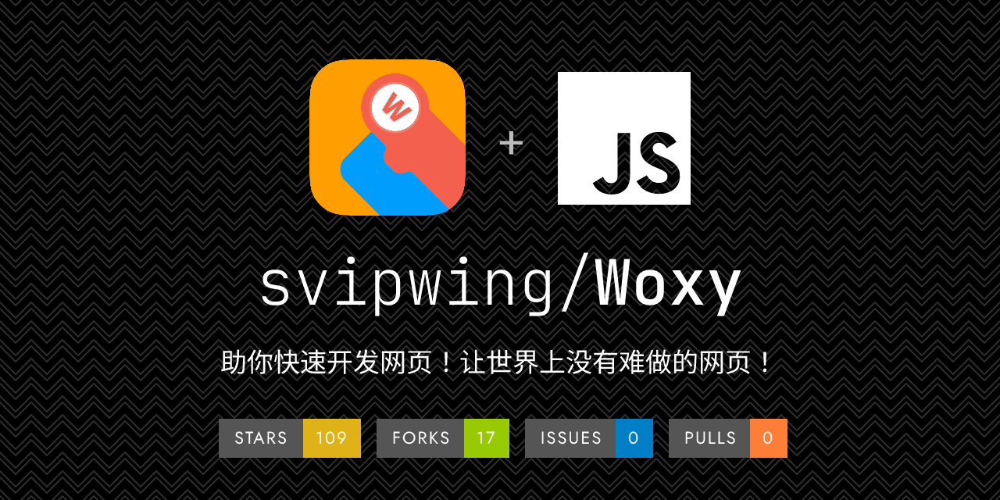

<h1 align="center"> 
  Woxy
</h1>

  <a href="README.md">中文</a> | <a href="README-EN.md">English</a>

  Helping you quickly develop web pages, making difficult web pages a thing of the past!

  
  
  

#### Announcement

The summer update plan has been launched.

#### Software Architecture

Developed based on Google Blockly, licensed under GPL-3.

#### Installation Guide

1. Download the release (if it has not been updated for a long time, please pull the latest `master` branch from the repository as the source code, and delete the `.git` directory).
2. Extract it to your host.
3. Open `index.html` to start using.

#### Usage Instructions

1. Drag and drop blocks to program.
2. Click **Run Code** to see the effect, then adjust as needed.
3. Once finished, click **Generate Code** and copy the code into an HTML file.

#### Notes

1. For first-time use or troubleshooting, please refer to the **Beginner's Guide** or join the QQ group: 135452025.
2. This tool is still in development, incomplete, and currently intended only for beginner learning purposes. Do not use it in production environments.

#### Development Team

1. 技术云 – Leader, Developer
2. CoolPlayLin – Developer
3. king2022 – Developer
4. 可执行程序 – Easter Egg Developer
5. Fgaoxing – UI Designer, Developer
6. WA – APK Packaging Feature Developer
7. 海藻酸钠 – Official Website Designer, Developer
8. 青柠 – Backend Developer, responsible for account system and cloud projects
9. 酶游明 – Frontend Developer, UI Optimization
10. zx – Frontend Developer, Block Addition

#### Contribution Guide

1. Fork this repository.
2. Create a new branch named `Feat_xxx`.
3. Commit your code.
4. Create a Pull Request.
