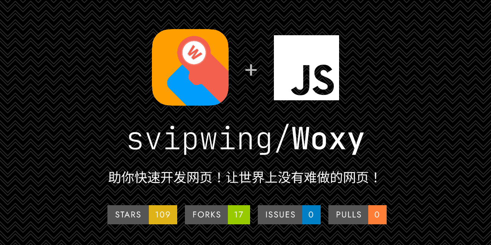
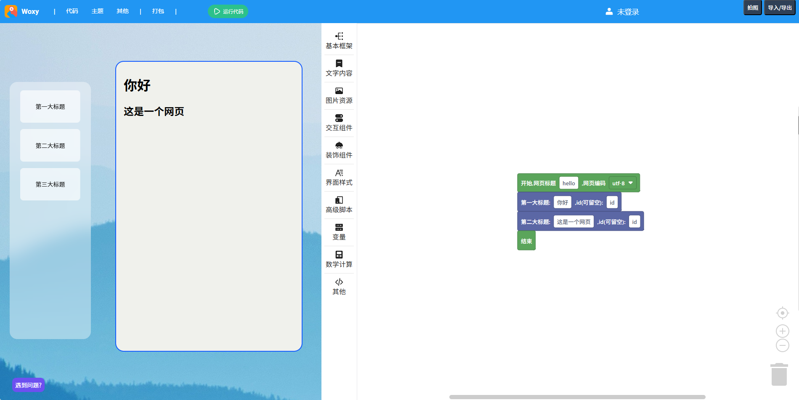
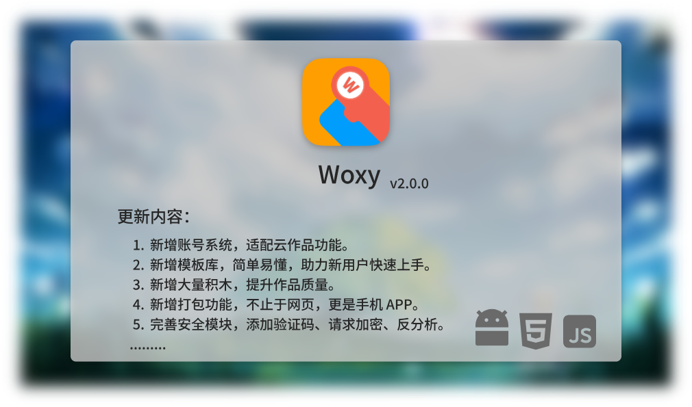

<h1 align="center">
  Woxy
</h1>

  <a href="README.md">中文</a> | <a href="README-EN.md">English</a>

  助你快速开发网页，让世界上没有难做的网页！

  
  
  

#### 公告

暑假更新计划已启动，以下是新版发布预告：

#### 软件架构

基于 Google Blockly 开发，采用 GPL-3 许可证。

#### 安装教程

1. 下载发行版（若长期未更新，请拉取最新仓库的 master 分支作为源码，并删除 `.git` 目录）。
2. 解压到主机。
3. 访问 `index.html`，开始使用。

#### 使用说明

1. 拖拽积木进行编程。
2. 点击**运行代码**，看看效果，然后再调整。
3. 写完之后，点击**生成代码**，复制代码到 HTML 文件。

#### 注意事项

1. 首次使用或遇到问题，请查看**新手指引**，或加 QQ 群：135452025。
2. 该工具正在开发阶段，未完工，目前仅供初学者学习所用，请不要用于生产环境。

#### 开发团队

1. jishuya，领导者、开发者
2. CoolPlayLin，开发者
3. king2022，开发者
4. 可执行程序，彩蛋开发者
5. Fgaoxing，界面设计师、开发者
6. WA - APK 打包功能开发者
7. 海藻酸钠 - 官网设计师、开发者
8. 青柠 - 后端开发者，负责账号系统和云作品
9. 酶游明 - 前端开发者，UI 优化
10. zx - 前端开发者，添加积木

#### 屎山程度

────────────────────────────────

  🌸 屎山代码分析报告 🌸

────────────────────────────────

  总体评分: 38.74 / 100 - 有点臭味，但还不至于熏死人
  
  屎山等级: 微臭青年 - 略有异味，建议适量通风

◆ 评分指标详情

  ✓✓ 状态管理             0.00分     状态管理清晰，变量作用域合理，状态可预测
  
  ✓ 错误处理             25.00分    有处理，但处理得跟没处理一样
  
  ✓ 代码结构             30.00分    结构还行，但有点混乱
  
  ○ 代码重复度            35.00分    有点重复，抽象一下不难吧
  
  • 循环复杂度            50.00分    绕来绕去，跟你脑子一样乱
  
  !! 注释覆盖率            89.48分    没有注释，靠缘分理解吧

  评分计算: (0.00×0.20 + 25.00×0.10 + 30.00×0.15 + 35.00×0.15 + 50.00×0.30 + 89.48×0.15) ÷ 1.05 = 38.74

◆ 诊断结论

  🌸 微臭青年 - 略有异味，建议适量通风

  👍 继续保持，你是编码界的一股清流，代码洁癖者的骄傲

────────────────────────────────

#### 参与贡献

1. Fork 本仓库。
2. 新建 Feat_xxx 分支。
3. 提交代码。
4. 新建 Pull Request。